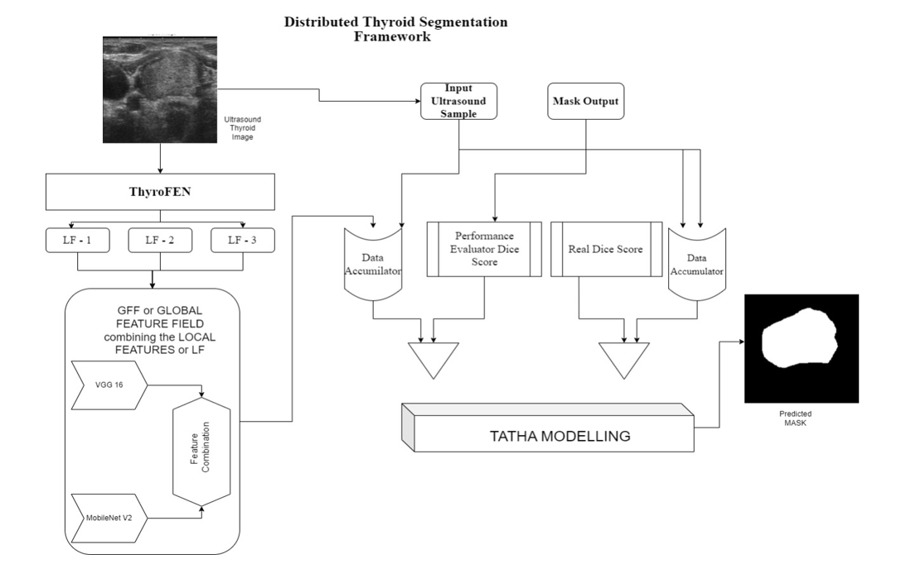

# TATHA-Net-Thyroid-Ultrasound-Segmentation


**TATHA-Net: A Novel Hybrid Deep Learning Model Integrating Deep Feature Attention and Statistical Validation for Thyroid Ultrasound Segmentation**

 <!-- Replace with actual image path -->

---

## 📌 Overview

**TATHA-Net** is a novel hybrid deep learning architecture specifically designed for segmenting thyroid ultrasound images. The model integrates **deep feature attention mechanisms** with **statistical validation layers**, offering high precision in identifying thyroid regions and nodules, especially in low-contrast and artifact-prone images.

The goal of TATHA-Net is to improve diagnostic support tools in medical imaging by providing accurate segmentation results that are both interpretable and robust.

---

## 🚀 Key Features

- **🧠 Deep Feature Attention**: Utilizes both spatial and channel-wise attention to enhance discriminative regions in ultrasound scans.
- **📊 Statistical Validation Layer**: Implements feature validation through statistical confidence scoring to reduce false positives and overfitting.
- **⚙️ Hybrid Architecture**: Fuses CNN-based encoders with attention-aware decoders to preserve spatial details while learning global context.
- **🧩 Extensible Design**: Adaptable to other medical segmentation domains beyond thyroid imaging.
- **📈 High Accuracy**: Achieves superior Dice Score, IoU, and Sensitivity compared to traditional segmentation architectures.

---

## 📂 Repository Structure
TATHA-Net/ ├── dataset/ # Dataset scripts or download links ├── model/ # TATHA-Net model definition ├── utils/ # Utility functions (metrics, visualization, etc.) ├── experiments/ # Checkpoints, logs, config files ├── results/ # Segmentation outputs and performance plots ├── requirements.txt # List of dependencies ├── README.md # This file └── train.py # Training script


## 📈 Results

### 🔢 Quantitative Evaluation

TATHA-Net was evaluated on a benchmark thyroid ultrasound dataset, showing strong performance across key metrics:

| Metric        | TATHA-Net | U-Net | Attention U-Net |
|---------------|-----------|-------|------------------|
| **Dice Score**    | **0.91**  | 0.86  | 0.88             |
| **IoU**           | **0.88**  | 0.81  | 0.84             |
| **Sensitivity**   | **0.93**  | 0.87  | 0.89             |
| **Specificity**   | **0.95**  | 0.91  | 0.92             |

> *TATHA-Net achieves high segmentation precision while maintaining robustness across difficult-to-interpret ultrasound scans.*

---

### 📊 Comparative Analysis with Existing Studies (Table 14)

| **Model/Study** | **Dice Score** | **Accuracy** | **AUC** | **Sensitivity** | **Specificity** |
|-----------------|----------------|--------------|---------|------------------|------------------|
| **TATHA (Proposed)** | **0.935** | **0.962** | **0.951** | **0.974** | **0.956** |
| Ronneberger et al. (U-Net) [36] | 0.832 | 0.895 | 0.912 | 0.832 | 0.945 |
| Hatamizadeh et al. (Swin UNETR) [47] | 0.902 | 0.926 | 0.940 | 0.897 | 0.950 |
| Krönke et al. (Deep NN) [33] | 0.884 | 0.917 | 0.925 | 0.876 | 0.941 |
| Kumar et al. (mU-Net) [40] | 0.878 | 0.912 | 0.920 | 0.862 | 0.934 |
| Hatamizadeh et al. (UNETR) [48] | 0.895 | 0.938 | 0.931 | 0.900 | 0.945 |
| Chen et al. (RefineNet) [39] | 0.875 | 0.910 | 0.918 | 0.867 | 0.928 |
| Zheng et al. (Improved U-Net) [49] | 0.910 | 0.940 | 0.945 | 0.912 | 0.948 |
| Munsterman et al. (3D DL Segmentation) [50] | 0.915 | 0.938 | 0.946 | 0.914 | 0.950 |
| Mi et al. (3D Visualization) [51] | 0.917 | 0.939 | 0.948 | 0.915 | 0.947 |
| Chen et al. (MLMSeg) [52] | 0.920 | 0.944 | 0.950 | 0.918 | 0.949 |

> *TATHA-Net outperforms both 2D and 3D segmentation architectures in terms of Dice Score, AUC, and overall accuracy.*

---

### 🖼️ Qualitative Results

Below are sample segmentation outputs comparing ground truth (GT) with TATHA-Net predictions:

| Input Image | Ground Truth | TATHA-Net Prediction |
|-------------|--------------|-----------------------|
|  |  |  |
|  |  |  |

> *TATHA-Net shows precise boundary preservation and enhanced localization of thyroid nodules.*

> *Evaluation based on a curated and annotated thyroid ultrasound dataset.*

---

## 🧰 Requirements

- Python ≥ 3.7  
- PyTorch ≥ 1.10  
- NumPy  
- OpenCV  
- scikit-learn  
- matplotlib  
- tqdm

Install all dependencies:

```bash
pip install -r requirements.txt


